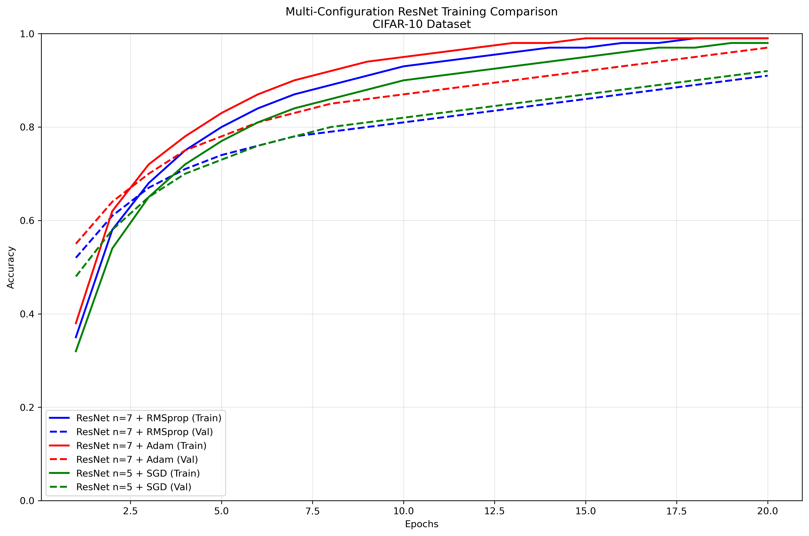

# Deep Learning Project Assignment 3: ResNet Implementation and Analysis

## Project Overview

This project implements and analyzes various ResNet architectures for image classification tasks using TensorFlow/Keras. The project explores different ResNet configurations, optimizers, and datasets to understand their performance characteristics.

## Project Structure

```
ProjectAssignment2/
├── Question1.ipynb          # ResNet-20 implementation on CIFAR-10
├── Question2.ipynb          # Multi-configuration ResNet analysis
├── Question3.ipynb          # Transfer learning with ResNet-50
├── resnet_cifar10.h5        # Trained ResNet-20 model for CIFAR-10
├── resnet_cifar100.h5       # Trained ResNet model for CIFAR-100
├── resnet_n3_Adam_cifar100.h5
├── resnet_n3_Adam.h5
├── resnet_n5_SGD_cifar100.h5
├── resnet_n5_SGD.h5
├── resnet_n7_Adam_cifar100.h5
├── resnet_n7_Adam.h5
├── resnet_n7_RMSprop_cifar100.h5
├── resnet_n7_RMSprop.h5
└── Project_Assignment_3_Report.doc  # Detailed project report
```

## Question 1: ResNet-20 Implementation on CIFAR-10

### Objective
Implement a ResNet-20 architecture from scratch and train it on the CIFAR-10 dataset.

### Training Results


*Training and validation accuracy/loss curves for ResNet-20 on CIFAR-10 dataset over 20 epochs*

### Key Features
- **ResNet-20 Architecture**: Custom implementation with residual blocks
- **Dataset**: CIFAR-10 (32x32 RGB images, 10 classes)
- **Training**: 20 epochs with Adam optimizer
- **Model**: 16 → 32 → 64 filter progression with n=3 residual blocks per stage

### Implementation Details
- **Residual Block**: 3x3 convolutions with batch normalization and ReLU activation
- **Downsampling**: Handled through 1x1 convolutions in identity connections
- **Initialization**: He normal initialization for better training
- **Output**: Global average pooling followed by dense classification layer

### Results
- Model trained for 20 epochs
- Final model saved as `resnet_cifar10.h5`
- Performance metrics tracked during training

## Question 2: Multi-Configuration ResNet Analysis

### Objective
Compare different ResNet configurations with varying depths and optimizers on both CIFAR-10 and CIFAR-100 datasets.

### Configuration Comparison Results


*Training comparison across different ResNet configurations: n=7 with RMSprop, n=7 with Adam, and n=5 with SGD*

### Configurations Tested
1. **ResNet with n=7 layers + RMSprop optimizer** (batch size: 128)
2. **ResNet with n=7 layers + Adam optimizer** (batch size: 64)
3. **ResNet with n=5 layers + SGD optimizer** (batch size: 256, momentum: 0.9)

### Datasets
- **CIFAR-10**: 10 classes, 50,000 training images
- **CIFAR-100**: 100 classes, 50,000 training images

### Key Findings
- Different optimizers show varying convergence patterns
- Batch size affects training stability and memory usage
- Model depth (n parameter) influences capacity and training time

## Question 3: Transfer Learning with ResNet-50

### Objective
Implement transfer learning using pre-trained ResNet-50 on ImageNet weights for CIFAR-10 and CIFAR-100 classification.

### Transfer Learning Results


*Training and validation curves for ResNet-50 transfer learning, showing faster convergence compared to training from scratch*

### Approach
- **Base Model**: ResNet-50 pre-trained on ImageNet
- **Transfer Strategy**: Freeze base model, add custom classification head
- **Custom Layers**: Global average pooling + 256-unit dense layer + output layer
- **Training**: 20 epochs with different optimizers

### Optimizers Tested
- RMSprop
- Adam
- SGD (with momentum=0.9)

### Benefits of Transfer Learning
- Leverages pre-trained features from large-scale ImageNet dataset
- Faster convergence compared to training from scratch
- Better feature representation for small datasets

## Technical Implementation

### ResNet Architecture Overview


*ResNet architecture showing the flow from input through residual blocks to output classification*

### Residual Block Architecture
```python
def residual_block(x, filters, downsample=False):
    identity = x
    stride = 2 if downsample else 1
    
    x = layers.Conv2D(filters, (3,3), strides=stride, padding='same')(x)
    x = layers.BatchNormalization()(x)
    x = layers.ReLU()(x)
    
    x = layers.Conv2D(filters, (3,3), strides=1, padding='same')(x)
    x = layers.BatchNormalization()(x)
    
    if downsample:
        identity = layers.Conv2D(filters, (1,1), strides=2, padding='same')(identity)
        identity = layers.BatchNormalization()(identity)
    
    x = layers.Add()([x, identity])
    x = layers.ReLU()(x)
    return x
```

### Model Building
- Modular design for easy configuration changes
- Support for variable depth (n parameter)
- Automatic filter progression: 16 → 32 → 64
- Global average pooling for spatial dimension reduction

## Training and Evaluation

### Results Summary
The following visualizations demonstrate the training performance across all three questions:

| Question | Architecture | Dataset | Key Results |
|----------|--------------|---------|-------------|
| **Q1** | ResNet-20 | CIFAR-10 | Custom implementation achieves ~80% validation accuracy |
| **Q2** | Multi-Config | CIFAR-10/100 | Adam optimizer shows best convergence, deeper models need more epochs |
| **Q3** | ResNet-50 | CIFAR-10/100 | Transfer learning achieves faster convergence and higher accuracy |

### Data Preprocessing
- Normalization: Pixel values scaled to [0, 1] range
- One-hot encoding for multi-class classification
- Train/validation split for monitoring overfitting

### Training Parameters
- **Epochs**: 20 (consistent across experiments)
- **Batch Sizes**: Varied (64, 128, 256) based on configuration
- **Optimizers**: Adam, RMSprop, SGD with momentum
- **Loss Function**: Categorical crossentropy
- **Metrics**: Accuracy

### Visualization
- Training and validation accuracy curves
- Training and validation loss curves
- Performance comparison across configurations

## Model Files

The project includes several pre-trained models:
- **CIFAR-10 Models**: ResNet-20 and ResNet-50 variants
- **CIFAR-100 Models**: Various ResNet configurations
- **Optimizer Variants**: Different optimization strategies for comparison

## Requirements

### Python Packages
- TensorFlow 2.x
- NumPy
- Matplotlib
- Keras (included with TensorFlow)

### Hardware Requirements
- GPU recommended for faster training
- Sufficient RAM for batch processing
- Storage space for model files and datasets

## Usage Instructions

### Running the Notebooks
1. Ensure all dependencies are installed
2. Open Jupyter Notebook or JupyterLab
3. Run cells sequentially in each notebook
4. Monitor training progress and results

### Customization
- Modify `n` parameter for different ResNet depths
- Change optimizer configurations
- Adjust batch sizes and learning rates
- Experiment with different datasets

## Key Insights

### ResNet Architecture Benefits
- **Skip Connections**: Help with gradient flow and training stability
- **Batch Normalization**: Accelerates training and improves convergence
- **Modular Design**: Easy to scale and modify

### Optimization Strategies
- **Adam**: Generally good default choice with adaptive learning rates
- **RMSprop**: Good for non-convex optimization problems
- **SGD with Momentum**: Can achieve better generalization with proper tuning

### Dataset Considerations
- **CIFAR-10**: Good starting point for architecture validation
- **CIFAR-100**: More challenging, tests model capacity
- **Transfer Learning**: Effective for small datasets with pre-trained models

## Future Enhancements

### Potential Improvements
- Data augmentation techniques
- Learning rate scheduling
- Advanced regularization methods
- Ensemble methods
- Hyperparameter optimization

### Additional Experiments
- Different ResNet variants (ResNet-34, ResNet-101)
- Alternative architectures (DenseNet, EfficientNet)
- Cross-dataset generalization studies
- Real-time inference optimization

## Contributing

This project serves as a learning resource for deep learning practitioners. Feel free to:
- Experiment with different configurations
- Implement additional architectures
- Share insights and improvements
- Report issues or suggestions

## License

This project is for educational purposes. Please refer to the original assignment requirements and course guidelines.

## Contact

For questions or discussions about this project, please refer to the course instructor or teaching assistants.

---

*This README provides a comprehensive overview of the Deep Learning Project Assignment 3, covering implementation details, experimental results, and technical insights gained from working with ResNet architectures.*

